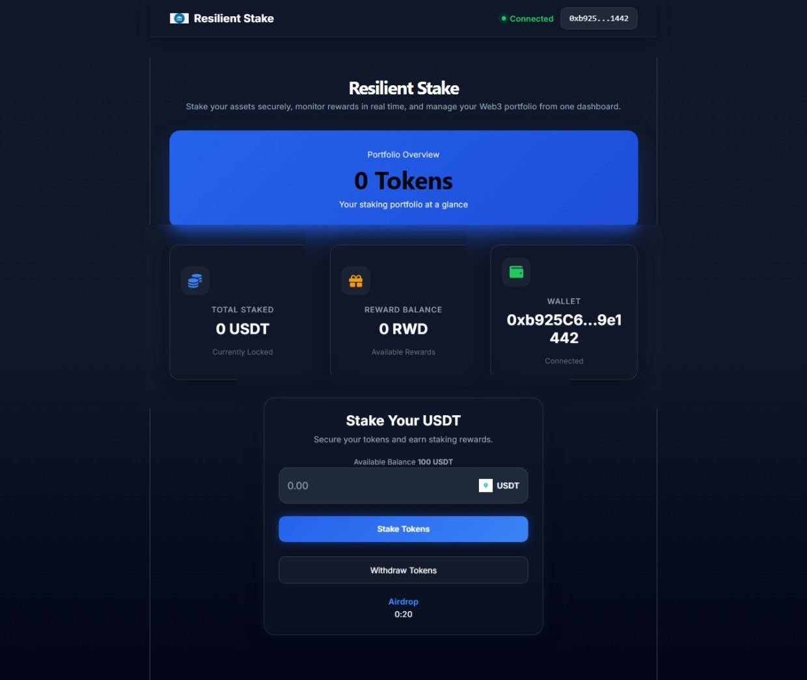
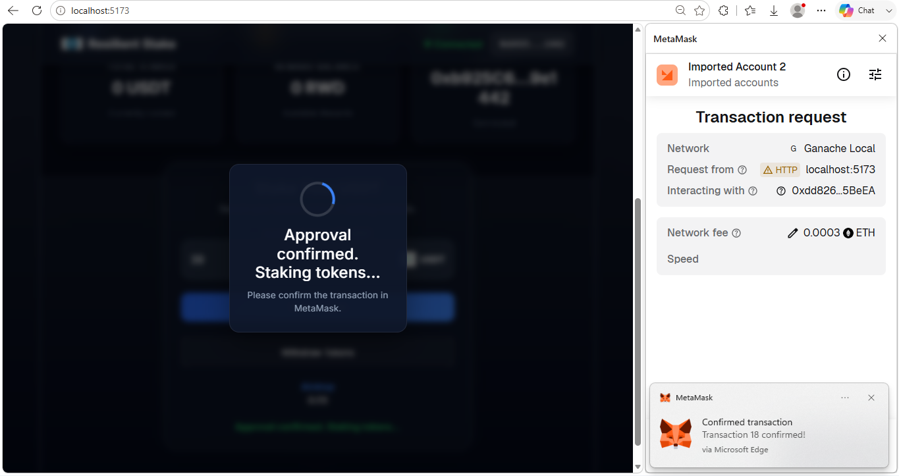
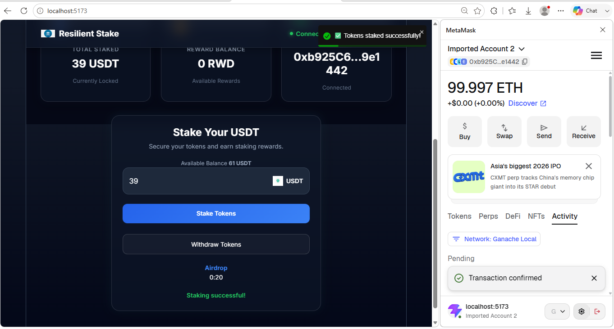
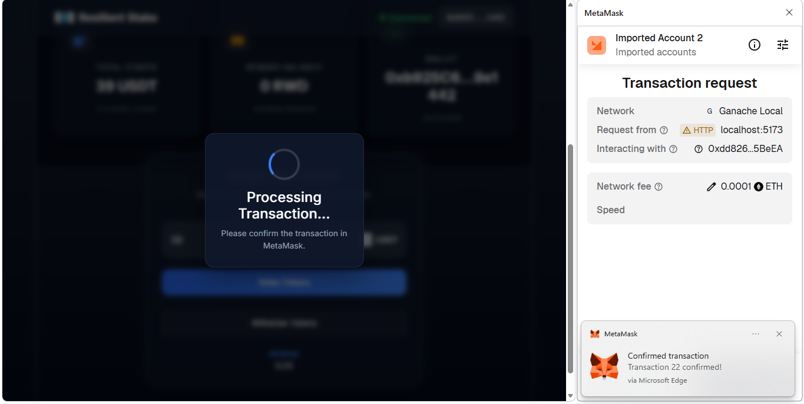
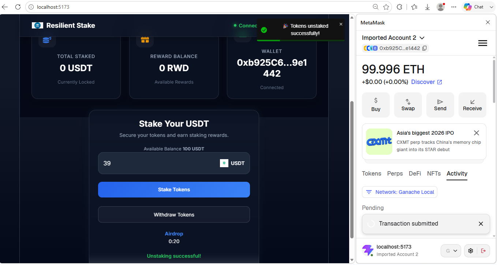

<div align="center">

# 🚀 Resilient Staking DApp

### A Modern DeFi Staking Platform Built with React, Solidity & Web3


</div>

---

A modern decentralized staking application built with **React**, **Vite**, **Solidity**, **Truffle**, **Web3.js**, and **MetaMask**.

Stake tokens, earn rewards, manage your assets, and interact securely with Ethereum smart contracts through an intuitive and responsive interface.

---

## 🌐 Live Demo

🚧 Deployment in progress.

A live demo will be available soon via Vercel.

---

## 📸 Project Preview

### Dashboard



---

### Loading Approval



---

### Staking Success



---

### Unstake Process



---

### Unstake Success



## ✨ Features

- 🔐 Secure MetaMask wallet connection
- 💰 Stake USDT tokens
- 🎁 Earn RWD reward tokens
- 🔄 Unstake tokens anytime
- 📊 Live balance updates
- 📈 Animated dashboard statistics
- 🌌 Interactive particle background
- 🎨 Modern glassmorphism interface
- ⏳ Transaction loading overlay
- 🔔 Toast notifications
- 📱 Fully responsive layout

---

## 🛠 Technology Stack

### Frontend

- React 18
- Vite
- Bootstrap 5
- React Icons
- React Toastify
- React CountUp

### Blockchain

- Solidity
- Truffle
- Ganache
- Web3.js

### Wallet

- MetaMask

---

## 🏗 Architecture

```text
            MetaMask
                │
                ▼
            Web3.js
                │
                ▼
      BlockchainContext
                │
     ┌──────────┴──────────┐
     ▼                     ▼
 React Components     Smart Contracts
                             │
               ┌─────────────┼─────────────┐
               ▼             ▼             ▼
            Tether         RWD      DecentralBank
```

## 📂 Project Structure

```text
src
│
├── components
│   ├── Navbar
│   ├── DashboardCards
│   ├── LoadingOverlay
│   ├── ParticleSettings
│   └── Main
│
├── contexts
│   └── BlockchainContext
│
├── truffle_abis
│
├── contracts
│
├── migrations
│
└── public
```

---

## 📋 Project Highlights

| Feature | Status |
|---------|--------|
| MetaMask Authentication | ✅ |
| Token Staking | ✅ |
| Reward Distribution | ✅ |
| Token Unstaking | ✅ |
| Glassmorphism UI | ✅ |
| Animated Statistics | ✅ |
| Loading Overlay | ✅ |
| Toast Notifications | ✅ |
| Responsive Design | ✅ |

## ⚙️ Installation

Clone the repository

```bash
git clone https://github.com/mikeisresilient/resilient-staking-dapp.git
```

Move into the project

```bash
cd resilient-staking-dapp
```

Install dependencies

```bash
npm install
```

Start Ganache

Deploy the contracts

```bash
truffle migrate --reset
```

Start the frontend

```bash
npm run dev
```

---

## 💡 How It Works

1. Connect your MetaMask wallet.
2. Approve USDT spending.
3. Stake your tokens.
4. Earn RWD rewards.
5. Unstake whenever you choose.
6. Balances update automatically after each transaction.

---

## 🚀 Future Improvements

- Portfolio analytics
- Transaction history
- Multi-token staking
- WalletConnect integration
- Dark and Light mode
- Sepolia deployment
- Smart contract security enhancements

---

## 👨‍💻 Author

**Michael Uchechukwu Ege**

Full Stack Web & Blockchain Developer

Web3 Educator

Technical Analyst

GitHub

https://github.com/mikeisresilient

---

## 🙏 Acknowledgements

This project was inspired by educational Web3 tutorials and expanded into a modern DeFi staking application with significant UI, UX, and architectural improvements.

Special thanks to the open source community and the maintainers of React, Solidity, Truffle, Vite, Web3.js, and MetaMask for providing the tools that made this project possible.

## 📄 License

This project is licensed under the MIT License.